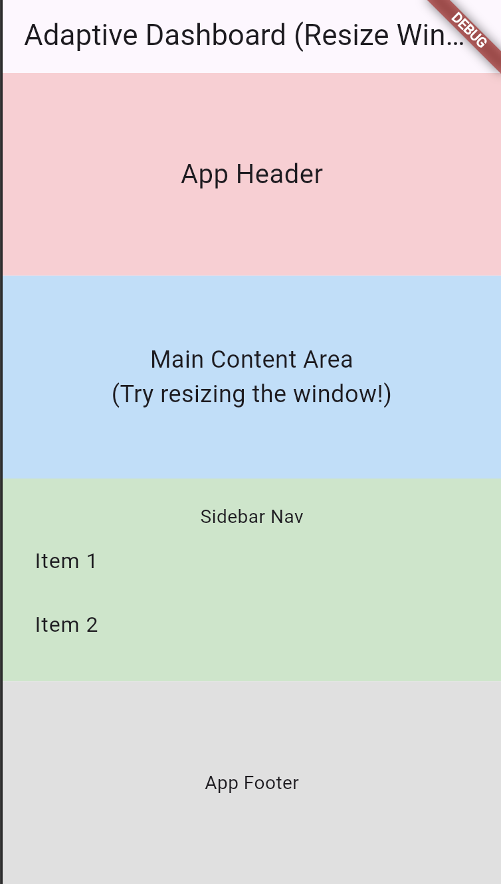

Flutter Adaptive Grid Layout
============================

A Flutter package for building declarative, responsive, and adaptive grid layouts inspired by CSS Grid Layout. Simplify complex UI adaptation across different screen sizes with intuitive ASCII-art-like templates.

[](https://www.google.com/search?q=https://pub.dev/packages/flutter_adaptive_grid_layout)[](https://www.google.com/search?q=https://github.com/YOUR_GITHUB_USERNAME/flutter_adaptive_grid_layout)[](https://opensource.org/licenses/MIT)

🌟 Features
-----------

`flutter_adaptive_grid_layout` aims to streamline the development of adaptive user interfaces by providing a powerful and declarative way to define your layouts.

-   **Declarative Templates:** Define your grid structure using an intuitive ASCII-art-like string similar to CSS Grid's `grid-template-areas`.
-   **Breakpoint-Based Adaptation:** Easily define different layouts for `compact`, `medium`, `expanded`, and `large` screen sizes, reacting to `MediaQuery` changes.
-   **Flexible & Fixed Sizing:** Control row and column dimensions with `FlexSize.flex()` for proportional scaling or `FlexSize.fixed()` for precise pixel sizes. `FlexSize.content()` allows for content-driven sizing (though with current `Stack`-based implementation, it behaves as flexible filler).
-   **Named Regions:** Assign meaningful names to grid areas and map your Flutter widgets directly to these regions.
-   **Simplified Responsive Design:** Reduce complex conditional `build` logic, leading to cleaner and more maintainable UI code.

🚀 Getting Started
------------------

### Installation

Add `flutter_adaptive_grid_layout` to your `pubspec.yaml` file:

YAML

```
dependencies:
  flutter:
    sdk: flutter
  flutter_adaptive_grid_layout: ^0.0.1 # Use the latest version from pub.dev

```

Then, run `flutter pub get` to fetch the package.

### Basic Usage

Wrap your adaptive layout with `AdaptiveLayoutSizeProvider` and use `AdaptiveGridLayout` to define your responsive structure.

Dart

```
import 'package:flutter/material.dart';
import 'package:flutter_adaptive_grid_layout/flutter_adaptive_grid_layout.dart';

void main() {
  runApp(const MyApp());
}

class MyApp extends StatelessWidget {
  const MyApp({super.key});

  @override
  Widget build(BuildContext context) {
    // Determine the current screen size based on breakpoints
    final currentLayoutSize = AdaptiveBreakpoints.materialDesign.fromWidth(
      MediaQuery.of(context).size.width,
    );

    return Scaffold(
      appBar: AppBar(
        title: const Text('Adaptive Dashboard (Resize Window)'),
      ),
      body: AdaptiveLayoutSizeProvider(
        size: currentLayoutSize,
        breakpoints: AdaptiveBreakpoints.materialDesign,
        child: AdaptiveGridLayout(
          breakpoints: AdaptiveBreakpoints.materialDesign,
          layoutTemplates: {
            // Define your layout for compact screens (e.g., mobile portrait)
            AdaptiveLayoutSize.compact: AdaptiveGridTemplate(
              size: AdaptiveLayoutSize.compact,
              template: [
                "header",
                "content",
                "sidebar", // Sidebar stacks below content
                "footer",
              ],
              columnSizes: [FlexSize.flex(1)], // Single column
              rowSizes: [FlexSize.content(), FlexSize.flex(1), FlexSize.content(), FlexSize.content()],
            ),
            // Define your layout for medium screens (e.g., tablets, mobile landscape)
            AdaptiveLayoutSize.medium: AdaptiveGridTemplate(
              size: AdaptiveLayoutSize.medium,
              template: [
                "header header",
                "sidebar content",
                "footer footer",
              ],
              columnSizes: [FlexSize.fixed(200), FlexSize.flex(1)], // Fixed 200px sidebar, rest for content
              rowSizes: [FlexSize.content(), FlexSize.flex(1), FlexSize.content()],
            ),
            // Define your layout for expanded screens (e.g., small desktops)
            AdaptiveLayoutSize.expanded: AdaptiveGridTemplate(
              size: AdaptiveLayoutSize.expanded,
              template: [
                "header header header",
                "nav    content  details",
                "footer footer  footer",
              ],
              columnSizes: [FlexSize.fixed(150), FlexSize.flex(2), FlexSize.flex(1)], // Nav fixed, content gets 2x flex, details 1x
              rowSizes: [FlexSize.content(), FlexSize.flex(1), FlexSize.content()],
            ),
            // Define your layout for large screens (e.g., large desktops)
            AdaptiveLayoutSize.large: AdaptiveGridTemplate(
              size: AdaptiveLayoutSize.large,
              template: [
                "header header header header",
                "nav    content  details  ads",
                "footer footer  footer  footer",
              ],
              columnSizes: [FlexSize.fixed(150), FlexSize.flex(2), FlexSize.flex(1), FlexSize.fixed(100)], // Even more columns
              rowSizes: [FlexSize.content(), FlexSize.flex(1), FlexSize.content()],
            ),
          },
          // Provide your actual widgets for each named region
          children: {
            'header': Container(
              color: Colors.red[100],
              padding: const EdgeInsets.all(8.0),
              child: const Center(child: Text('App Header', style: TextStyle(fontSize: 20))),
            ),
            'sidebar': Container(
              color: Colors.green[100],
              padding: const EdgeInsets.all(8.0),
              child: const Column(
                mainAxisAlignment: MainAxisAlignment.center,
                children: [
                  Text('Sidebar Nav'),
                  ListTile(title: Text('Item 1')),
                  ListTile(title: Text('Item 2')),
                ],
              ),
            ),
            'nav': Container(
              color: Colors.purple[100],
              padding: const EdgeInsets.all(8.0),
              child: const Column(
                mainAxisAlignment: MainAxisAlignment.center,
                children: [
                  Text('Main Nav'),
                  ListTile(title: Text('Dashboard')),
                  ListTile(title: Text('Settings')),
                ],
              ),
            ),
            'content': Container(
              color: Colors.blue[100],
              padding: const EdgeInsets.all(8.0),
              child: const Center(child: Text('Main Content Area\n(Try resizing the window!)', textAlign: TextAlign.center, style: TextStyle(fontSize: 18))),
            ),
            'details': Container(
              color: Colors.orange[100],
              padding: const EdgeInsets.all(8.0),
              child: const Center(child: Text('Details Panel')),
            ),
            'ads': Container(
              color: Colors.yellow[100],
              padding: const EdgeInsets.all(8.0),
              child: const Center(child: Text('Advertisements')),
            ),
            'footer': Container(
              color: Colors.grey[300],
              padding: const EdgeInsets.all(8.0),
              child: const Center(child: Text('App Footer')),
            ),
          },
        ),
      ),
    );
  }
}

```

### Understanding the Template (`AdaptiveGridTemplate`)

The `template` property in `AdaptiveGridTemplate` is a `List<String>`, where each string represents a row. Words in the string represent named areas, and `.` represents an empty cell. Repeating a name spans that area across multiple columns.

Example `template`:

Dart

```
[
  "header header",
  "sidebar content",
  "footer footer",
]

```

This defines a 3-row, 2-column grid where:

-   The `header` spans the first row across both columns.
-   `sidebar` is in `(1,0)` and `content` in `(1,1)`.
-   `footer` spans the third row across both columns.

### Sizing Rows and Columns (`FlexSize`)

`columnSizes` and `rowSizes` define how the grid tracks (rows/columns) are sized:

-   `FlexSize.flex(factor)`: Takes a proportional amount of available space. `factor` defaults to 1.0. (e.g., `FlexSize.flex(2)` takes twice the space of `FlexSize.flex(1)`).
-   `FlexSize.fixed(pixels)`: Takes a fixed size in logical pixels. (e.g., `FlexSize.fixed(200)` for a 200px wide sidebar).
-   `FlexSize.content()`: Aims to size based on the intrinsic content. **(Current implementation is a basic approximation using available flexible space; for precise content-based sizing, a custom `RenderObjectWidget`would be ideal).**
-   `FlexSize.auto()`: Similar to `FlexSize.content()`, often implying minimal space or filling remaining space.

🖼️ Screenshots
---------------

See `flutter_adaptive_grid_layout` in action across different screen sizes:

### Compact Layout (e.g., Mobile Portrait)

On smaller screens, the sidebar moves below the main content, optimizing for vertical space.




### Medium Layout (e.g., Tablet / Desktop Narrow)

This layout provides a sidebar on the left and main content on the right, suitable for moderate screen widths.

### Large Layout (e.g., Desktop Wide)

For expansive screens, additional panels (like details and ads) appear, utilizing the extra horizontal space.


⚙️ Advanced Usage & Notes
-------------------------

-   **Custom Breakpoints:** You can define your own `AdaptiveBreakpoints` instance instead of using `AdaptiveBreakpoints.materialDesign` if your app requires different size thresholds.
-   **Performance:** For extremely complex grids or highly dynamic content, consider that the current `Stack` and `Positioned` based implementation is a basic approximation. For true CSS Grid-like intrinsic sizing and advanced performance, a custom `RenderObjectWidget` or `CustomMultiChildLayout` would be a more robust (and complex) solution.

🤝 Contributing
---------------

Contributions are welcome! If you find a bug or have a feature request, please open an issue or submit a pull request on GitHub.

📄 License
----------

This package is licensed under the MIT License. See the `LICENSE` file for more details.